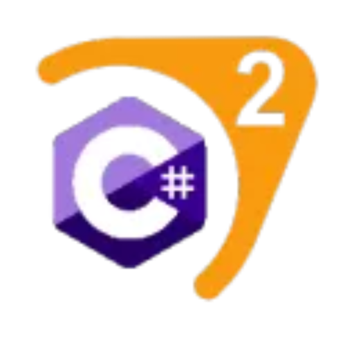

  

    

      
      <h1 class="h1">CounterStrikeSharp</h1>
      CounterStrikeSharp is a simpler way to write CS2 server plugins.
      

        <a href="docs/guides/getting-started.md" class="btn btn-primary btn-lg fw-bold">Get Started <i class="bi bi-arrow-right"></a>
      

    

  

